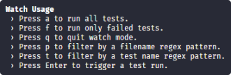

# Dasa Challenge (Front End)
The project lists a GitHub user's repositories

## Technologies used
- React with the libraries:
  - Toastify
  - Eslint
  - Axios
  - Font-Awesome
  - Prop-Types
  - Jest

## Prerequisite
It's necessary that in the application environment you've: 

- Dependency management, you may choose Yarn (https://yarnpkg.com/lang/en/) or NPM (https://www.npmjs.com/).

## Installation
For the correct operation of the application, it's necessary to perform the following procedures: 

- Load libraries for project using the commands below in project directory, it's corresponding to your dependency management:

      yarn

  or

       npm install

## Usage
At the root of project path use the command below, it's corresponding to your dependency management:

     yarn start

or

    npm run start

The project will be displayed to `http://localhost:3000`

## Functionality
You must type the Git User'name to search in the text box then click in the "Buscar repositórios" button.

  

## Testing
At the root of project path use the command below, it's corresponding to your dependency management:

     yarn test

or

    npm test

It'll launche the test runner in the interactive watch mode.

In this mode, you need click **'a'** and the **Enter** key to run all tests, and to close you click **'q'** and the **Enter** key.
